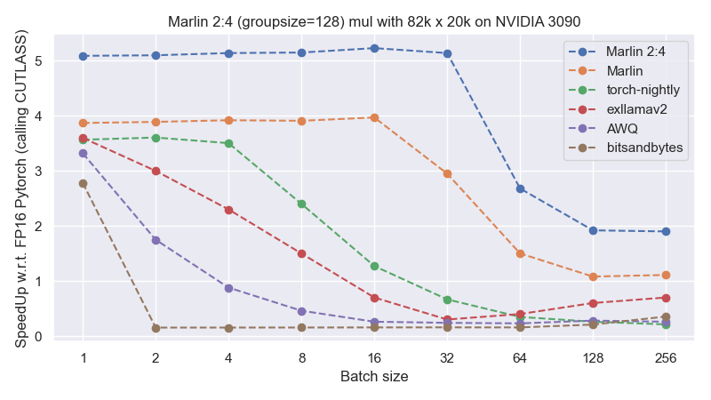
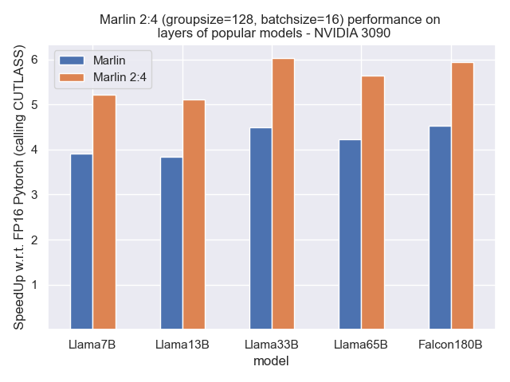
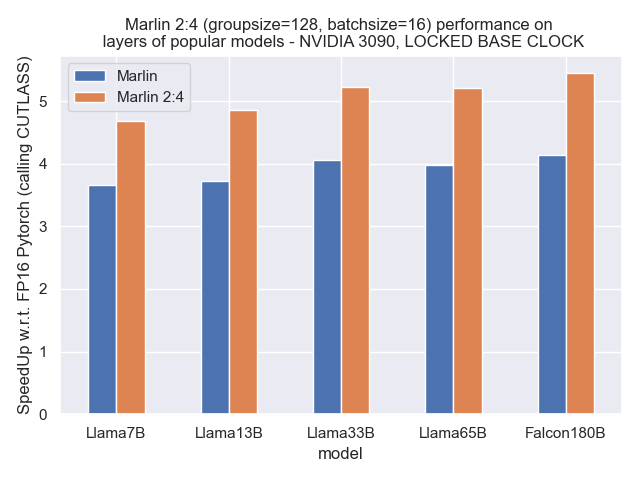

<div align="center">
  
</div>

# Sparse-Marlin
This is Sparse-Marlin, an extension of the [**M**ixed **A**uto-**R**egressive **Lin**ear](https://github.com/IST-DASLab/marlin/tree/master) dense kernel for 4-bit quantized weights, now with support for 2:4 sparsity.
Sparse-Marlin is an extremely optimized GPU kernel performing a matrix multiply and accumulate operation, ```C=AxB```, where ```A``` and ```C``` are FP16 matrices, and ```B``` is a 50% sparse matrix following the 2:4 format, whose values are quantized and stored in INT4 precision.
Integrating a 2:4 sparsity scheme on top of the existing 4-bit quantized weight representation offers a promising opportunity to further enhance the FLOPS/Byte ratio, and push the baseline performance further.
Sparse-Marlin boosts the close-to-ideal performance of dense Marlin, and provides near-optimal speedups of around 5.3x, while being more robust to larger batch sizes.

Sparse-Marlin design inherits all the techniques and optimizations of the original dense Marlin kernel, being able to fully utilize all available GPU resources (global memory, L2 cache, shared memory, tensor cores, vector cores), ***simultaneously***. In a simplified manner, Sparse-Marlin adds, on top of the existing optimization, the following points:

* We carefully include the 2:4 metadata loads into the original Marlin software pipeline (GMEM->SMEM->RF), ensuring that both GPU pipelines are well saturated and do not bottleneck each other, trying to hide memory latencies with computation.

* We perform the computation on Sparse Tensor Cores (SPTCs) using wider instructions of shape ```m16xn8xk32``` and FP32 accumulators, which will be downcasted (same as dense Marlin) to FP16 during the global reduction step.

* Quantized weights, metadata for 2:4 sparsity, and group scales are reshuffled offline following a new layout structure that gives ideal memory access patterns and SPTC data organization.

* We improve the output result writing, allowing the usage of the widest storage instructions possible in both SMEM and GMEM writing.

* The PTX assembly of the kernel was subjected to meticulous analysis, once again utilizing NSight-Compute, to enhance performance and hardware usage.

## Microbenchmarking

We first compare the performance of Marlin and Sparse-Marlin on a large matrix with increasing batch sizes that can be ideally partitioned on an NVIDIA 3090 GPU. All kernels are executed at groupsize 128.

<div align="center">
  
</div>

Note that with 2:4 sparsity, additionally to the storage overhead of the group scales, there is an storage overhead of the sparse metadata structure, which contains two 2-bit indices for each set of consecutive 4 elements.
While Marlin is able to preserve close-to-ideal 4x performance up to a batch size of 16, Sparse-Marlin, which also achieves near-optimal a performance of about 5.3x, is able to preserve this condition with a batch size twice as large (i.e., 32).

In addition, once performance decays for larger batch sizes, Sparse-Marlin can still take advantage of SPTCs to consistently deliver 2x over the dense FP16 counterpart.

Next figure shows the performance of both kernels across all linear layers in Transformer blocks of popular open-source models with a batch size of 16.

<div align="center">
  
</div>

Finally, we also study what performance can be sustained over longer periods of time, at locked base GPU clock.
Again, as the original dense Marlin kernel demonstrated, we can see that it also has no effect on the virtually optimal Sparse-Marlin performance (relative to the lower clock setting).

<div align="center">
  
</div>

## Requirements:

* CUDA >= 11.8 (in particular also for the `nvcc` compiler, the version of which should match with torch)
* NVIDIA GPU with compute capability >= 8.0 (Ampere or Ada, Marlin is not yet optimized for Hopper)
* `PyTorch >= 2.0.0`
* `numpy`

## Usage:

If all requirements are met, it should be possible to install Marlin 2:4 by calling

```
pip install .
```

in the root folder of this repository.

Afterwards, the easiest way to use the Sparse-Marlin kernel is via a `marlin.Layer_2_4`, a torch-module representing a Marlin
quantized layer with 2:4 sparsity.

It allows converting a "fake-quantized" (dequantized values stored in FP16) `torch.Linear` layer into
the compressed Marlin format via `marlin.Layer_2_4.pack(linear, scales)`.

Alternatively, the kernel can also be called directly through `marlin.mul_2_4(..)`, provided that weights
and scales have already been appropriately preprocessed (see `marlin.Layer_2_4.pack(...)`).

The kernel itself  can be found in the self-contained `marlin/marlin_cuda_kernel_nm.cu` file,
which does not contain any dependencies beyond base-CUDA and should thus be easy to integrate into other lower-level
frameworks.

Correctness tests can be executed via `python test_2_4.py` and benchmarks via `python bench_2_4.py`.

Please note that in order to reproduce our "sustainable performance" benchmarks, the GPU clocks need to be locked to
their respective base values using:

```
sudo nvidia-smi --lock-gpu-clocks=BASE_GPU_CLOCK --lock-memory-clocks=BASE_MEM_CLOCK
```

## Cite:

If you found this work useful, please consider citing:

```
@misc{castro2024sparsemarlin,
  author = {Castro, Roberto L. and Alistarh, Dan},
  title = {Sparse-Marlin: Boosting 4-bit inference kernels with 2:4 Sparsity},
  year = {2024},
  publisher = {GitHub},
  journal = {GitHub repository},
  howpublished = {\url{https://github.com/IST-DASLab/Sparse-Marlin}}
}
```